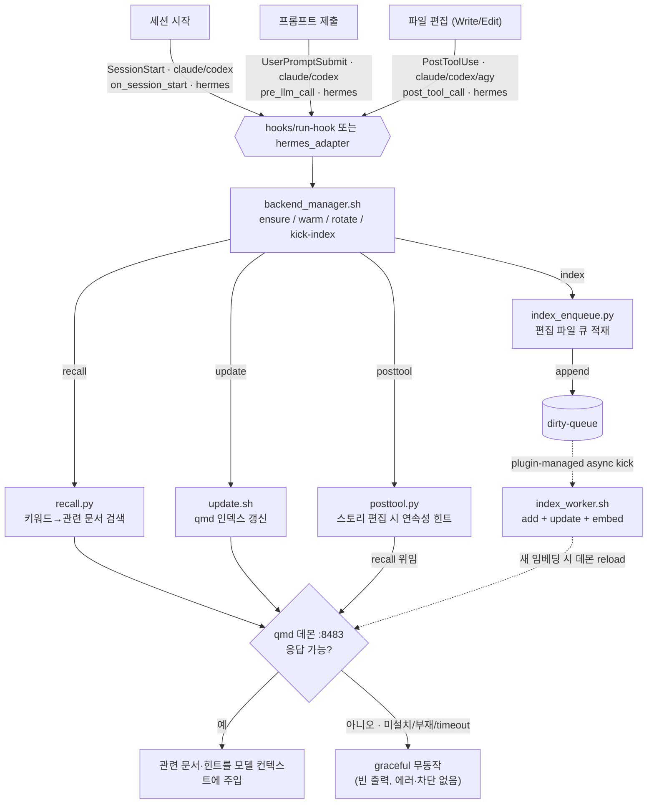

# qmd auto-context

qmd 기반 자동 컨텍스트 주입 플러그인. **Claude Code · Codex · Hermes Agent**에서는 세션 시작 인덱스 갱신, 프롬프트별 관련 문서 recall, 편집 전 gate, 편집 후 자동 인덱싱을 제공한다. Claude·Codex는 편집 후 연속성 힌트도 모델 컨텍스트로 주입한다. **Antigravity(Gemini)** 는 프로젝트 로컬 훅으로 편집 후 연속성 힌트와 자동 인덱싱만 지원한다.

흩어져 있던 글로벌/프로젝트 qmd 훅을 단일 리포로 SSOT화했다. 플랫폼 무관 `core/` 1벌 + Claude/Codex/Gemini용 `hooks/run-hook` 디스패처 + Hermes용 얇은 Python plugin adapter 구조.

## 구조

```
core/        recall.py · update.sh · posttool.py · index_enqueue.py · sync.py · backend_manager.sh · config.py · keywords.py · resolve_paths.py · collection_match.py · agy_local_install.py
hooks/       run-hook (단일 디스패처) · hooks.json · hooks-codex.json
hermes_adapter/  Hermes Agent plugin hook adapter (pre_llm_call/on_session_start/pre_tool_call/post_tool_call)
skills/      sync · query · update (수동 워크플로우)
backend/     daemon.sh · keepalive.sh · logrotate.sh · index_worker.sh
scripts/     agy-local-hook-install.sh · cleanup-legacy.sh
test/        *.test.mjs (node:test)
```

## 동작

| 훅 | 역할 (core 스크립트) | Claude | Codex | Hermes Agent | Gemini(agy) |
|----|------|--------|-------|--------------|-------------|
| 세션 시작 | qmd 인덱스 갱신 (`update.sh`) | `SessionStart` | `SessionStart` | `on_session_start` | — |
| 프롬프트 제출 | 관련 문서 recall (`recall.py`) | `UserPromptSubmit` | `UserPromptSubmit` | `pre_llm_call` | — |
| 편집 전 | pending 프로젝트 gate (`preflight_gate.py`) | `PreToolUse` | `PreToolUse` | `pre_tool_call` | — |
| 편집 후 | 연속성 힌트 (`posttool.py`) + 자동 인덱싱 enqueue (`index_enqueue.py`) | `PostToolUse` | `PostToolUse` | `post_tool_call`(index 중심) | `PostToolUse` |

Claude/Codex/Gemini는 `hooks/run-hook <action> <engine>` 디스패처가 훅 진입점이다(action: recall/update/posttool/index/gate). Hermes Agent는 `plugin.yaml`/`__init__.py` 기반 Python plugin으로 `hermes_adapter/`가 동일한 `core/<script>`에 JSON stdin을 패스스루한다. 두 경로 모두 engine 라벨/로그 경로/sandbox 가드 후 `core/backend_manager.sh`로 qmd backend를 ensure/kick하고 **도메인 로직은 core/가 SSOT**로 유지한다.

Claude·Codex는 marketplace 플러그인으로 세 이벤트를 모두 받는다. Hermes Agent는 Hermes plugin system의 `pre_llm_call`(Claude `UserPromptSubmit` 대응), `on_session_start`, `pre_tool_call`, `post_tool_call`을 쓴다.

> ⚠️ **Gemini(agy)는 실험적(experimental) 지원이다.** marketplace를 지원하지 않아 `scripts/agy-local-hook-install.sh <프로젝트>`로 `.agents/hooks.json`에 `PostToolUse`(posttool+index)만 등록한다 — 즉 **편집 후 연속성 힌트(posttool, recall 위임)+자동 인덱싱(index)만** 동작하고, 세션 인덱스 갱신(`update`)·프롬프트 단위 recall(`UserPromptSubmit`)은 아직 없다(`AfterTool` 미발동으로 `PostToolUse` matcher `write_to_file|replace_file_content|multi_replace_file_content` 사용). backend는 동일한 plugin runtime manager가 ensure/kick한다. **프롬프트 recall·세션 update 등 완전 지원은 향후 제공 예정.**

### 흐름도



> **플랫폼 차이**: Claude·Codex는 세 이벤트(`SessionStart`/`UserPromptSubmit`/`PostToolUse`)를 모두 받고, Hermes Agent는 `on_session_start`/`pre_llm_call`/`pre_tool_call`/`post_tool_call`로 같은 core를 호출한다. 단, Hermes `post_tool_call`은 observer hook이라 반환값을 같은 턴 모델 컨텍스트에 주입하지 않는다 — Hermes 경로의 편집 후 처리는 자동 인덱싱 중심이며 posttool 힌트는 best-effort 실행만 한다. **Gemini(agy)는 `PostToolUse`만**(실험적) 받는다 — 세션 시작 인덱스 갱신(`update`)·프롬프트 recall이 없고 **편집 후 연속성 힌트(`posttool`)+자동 인덱싱(`index`)만** 동작한다. agy 완전 지원은 향후 제공 예정.

### qmd 미설치 / 데몬 부재 시

모든 훅은 graceful하게 **무동작**한다 — 에러를 내거나 세션을 막지 않는다. CLI fallback이 없어 데몬 HTTP(`:8483`)만 바라본다.

- **recall / posttool**: 데몬 `/health` 실패 시 빈 출력(`reason=daemon_unreachable`). 컨텍스트 주입만 안 될 뿐 프롬프트는 정상 진행된다.
- **update / posttool / index**: hook dispatcher가 backend manager를 통해 qmd 존재/버전과 daemon 상태를 조용히 확인한다.
- **index_enqueue**: 편집 파일을 dirty 큐에 적재만 한다(qmd 미호출). qmd가 설치되어 있으면 backend manager가 one-shot worker를 비동기로 kick한다.

즉 **빈 출력은 정상 동작**이다(빈 출력 ≠ 버그). 원인 구분은 `QMD_RECALL_LOG`의 `reason` 필드로 본다.

## 설정 / opt-in (프로젝트 로컬)

동의·거절·설정은 **프로젝트 루트 `.auto-context.json` 단일 파일**로 표현한다. **파일이 없으면 인덱싱·검색하지 않고**(미동의=pending), 세션 시작 시 1회 안내만 한다. 동의/거절은 헬퍼 한 줄로:

```bash
bash core/update.sh --optin  [<프로젝트경로>]   # 동의 → 인덱싱 + 매 세션 자동 갱신
bash core/update.sh --optout [<프로젝트경로>]   # 거절 → 인덱싱·검색 안 함 (영구 침묵)
```

큰 저장소에서 루트 전체 인덱싱을 피하려면 **추천 기반 opt-in**을 쓴다:

```bash
bash core/update.sh --recommend [<프로젝트경로>]              # 추천 확인 (read-only, 파일 변경 없음)
bash core/update.sh --recommend --json [<프로젝트경로>]       # 추천 결과를 JSON으로 출력
bash core/update.sh --optin --recommended [<프로젝트경로>]    # 추천 적용 → .auto-context.json 생성
bash core/update.sh --skip [<프로젝트경로>]                   # 이 프로젝트 임시 gate 통과 마커 (TTL 2h, cwd 단위)
```

`--recommend`는 `docs/current`, `docs/plans`, `docs` 등 좁은 경로를 탐색해 크기 가드를 통과한 경로만 추천한다(read-only — 파일을 생성·변경하지 않는다). `--optin --recommended`는 추천 결과를 `.auto-context.json`으로 원자 기록한다. **plain `--optin`은 루트 전체를 컬렉션으로 설정하므로 큰 저장소에는 `--optin --recommended`가 안전하다.**

### gate (미설정 프로젝트 편집 차단)

pending 프로젝트에서 Edit·Write·apply_patch 등 편집 도구를 쓰면 **`PreToolUse`/`pre_tool_call` 훅이 deny/block**으로 차단한다(Claude·Codex·Hermes 적용, agy 제외). 세션 시작 시 안내된 5가지 선택지(추천 확인 / 추천 적용 / 직접 작성 / 거절 / 이번만 건너뜀) 중 하나를 실행하면 통과한다. `--skip`은 TTL 2h 마커 파일을 생성해 해당 세션 내 gate를 해제한다.

상태는 명시 boolean `indexing`으로 결정된다(`true`=동의 / `false`=거절 / 파일 없음=pending):

```jsonc
{
  "indexing": true,                  // 필수: 인덱싱 동의 여부
  "name": "내 프로젝트",
  "collections": ["proj-manuscript", "proj-plot"],
  "minScore": 0.8,
  "collectionPaths": { "proj-manuscript": "04_Manuscript" }, // posttool reader-facing 판별
  "lexicalPatterns": ["ep"],         // EP/화 번호 exact 검색 (소설 도메인)
  "prefixStyle": "full",             // "full"(기본) | "tag"(마지막 세그먼트)
  "skipPaths": [".auto-context-ignore"],
  "topN": 3, "queryTimeout": 5
}
```

레거시 `.agents/qmd-recall.json`은 하위호환으로 계속 읽힌다(`indexing` 키 없으면 collections 있을 때 동의로 간주). `--optin` 실행 시 레거시 내용을 그대로 `.auto-context.json`으로 승계한다.

## 설치 / 제거

Claude·Codex는 marketplace 플러그인 설치만으로 훅과 skill이 등록된다. Hermes Agent는 Hermes plugin system에 설치/enable하면 Python hook adapter가 등록된다. 이 저장소는 더 이상 제품용 `install.sh`/`uninstall.sh`를 제공하지 않는다.

```bash
# 1. Claude Code: marketplace 등록 후 플러그인 설치
/plugin marketplace add zbdulee/qmd-auto-context
/plugin install qmd-auto-context

# Hermes Agent: plugin 설치 후 enable (Hermes plugin은 opt-in)
hermes plugins install zbdulee/qmd-auto-context
hermes plugins enable qmd-auto-context

# 2. qmd 의존성 설치 (지원 버전 >=2.5.3 <3.0.0)
bun add -g @tobilu/qmd@2.5.3
# 또는: npm install -g @tobilu/qmd@2.5.3
```

```bash
bash scripts/agy-local-hook-install.sh <프로젝트>  # Gemini(agy): 해당 프로젝트 .agents/hooks.json에 PostToolUse(posttool+index) 등록
bash scripts/cleanup-legacy.sh --dry-run          # 기존 글로벌 qmd 훅/managed LaunchAgent cleanup 계획 확인
bash scripts/cleanup-legacy.sh                    # 기존 글로벌 qmd 훅/managed LaunchAgent cleanup 실행
```

backend는 plugin runtime manager가 세션/skill 실행 중 관리한다. qmd CLI가 없거나 지원 버전 밖이면 hook은 조용히 no-op하고 manual skill이 설치/업그레이드 안내를 출력한다.

### sandbox

`QMD_SANDBOX=true`/`GEMINI_SANDBOX=true` 또는 `--sandbox` 인자 시 디스패처/코어는 즉시 무출력 종료(격리 환경 데몬 hang 방지).

## 백엔드

`core/backend_manager.sh`가 plugin runtime에서 qmd MCP HTTP 데몬(8483), warm ping, logrotate, index worker kick을 관리한다. `qmd` CLI가 없거나 지원 버전(`>=2.5.3 <3.0.0`) 밖이면 훅은 조용히 no-op하고 manual skill은 pinned 설치 안내를 출력한다. 훅은 `qmd`를 자동 설치/업그레이드하지 않는다.

편집 후 자동 인덱싱: PostToolUse 훅이 편집 파일을 dirty 큐에 쌓으면, backend manager가 `index_worker.sh`를 one-shot background worker로 kick해 해당 컬렉션만 `qmd collection add`+`qmd update`+`qmd embed`한다.

## 수동 skills

| Hook 동작 | Skill | 용도 |
|----------|-------|------|
| `UserPromptSubmit` recall | `query` | 관련 문서 수동 조회 |
| `SessionStart` update | `update` | 인덱스 수동 갱신 |
| `PostToolUse` index | `sync` | 훅이 놓친 CUD 변경 감지 후 dirty queue enqueue |

`PostToolUse` posttool의 연속성 힌트는 hook-only 기능이다. 편집 직후 자동 실행되는 경로라 별도 수동 skill로 노출하지 않는다.

### sync

`sync` skill은 `.auto-context.json`의 `collectionPaths`를 스캔해 이전 snapshot과 현재 파일 상태를 비교한다. 생성/수정/삭제가 감지된 collection만 dirty queue에 넣고, 실제 qmd 갱신은 plugin-managed worker가 처리한다. 삭제 처리는 파일 단위 qmd 명령이 아니라 `qmd update`의 removed 처리에 맡긴다.

```bash
bash "$PLUGIN_ROOT/skills/sync/scripts/sync.sh" "$PWD"
```

inspection만 원하면 `--dry-run`, 최초 snapshot만 만들고 queue를 건드리지 않으려면 `--baseline-only`를 추가한다.

### query

`query` skill은 훅의 `UserPromptSubmit` recall과 같은 `core/recall.py` 경로를 수동으로 실행한다. 실행 전 backend manager가 qmd 설치/버전과 daemon 준비를 확인한다. `.auto-context.json` opt-in, `QMD_QUERY_FIXTURE`, `QMD_DAEMON_URL`, minScore/topN 필터와 빈 출력 정책을 그대로 따른다.

```bash
bash "$PLUGIN_ROOT/skills/query/scripts/query.sh" "$PWD" "검색할 질문"
```

### update

`update` skill은 훅의 `SessionStart`와 같은 `core/update.sh` 경로를 수동으로 실행한다. 실행 전 backend manager가 qmd 설치/버전, daemon 준비, warm, logrotate를 처리한다. `.auto-context.json` opt-in, risky path 검사, qmd 부재 시 graceful no-op 정책을 그대로 따른다.

```bash
bash "$PLUGIN_ROOT/skills/update/scripts/update.sh" "$PWD"
```

## 테스트

```bash
npm test    # node --test, 결정적 단위/회귀 테스트
QMD_LIVE=1 node --test test/integration.test.mjs   # 데몬 라이브 스모크
```

데몬 응답은 `test/fixtures/`로 주입(`QMD_QUERY_FIXTURE`)해 라이브 의존 없이 결정적으로 검증한다.
