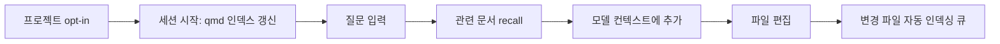

# qmd auto-context

qmd auto-context는 프로젝트 안의 문서와 메모를 자동으로 찾아서 에이전트 대화에 넣어 주는 플러그인입니다. 매번 "이 문서도 참고해"라고 붙여 넣지 않아도, 질문과 관련된 내용을 qmd에서 찾아 컨텍스트로 전달합니다.

현재 README는 **Claude Code**, **Codex**, 그리고 **Hermes Agent plugin 경로**를 다룹니다.

## 무엇을 해주나

- 세션을 시작할 때 qmd 인덱스를 최신 상태로 맞춥니다.
- 사용자가 질문하면 관련 문서를 찾아 모델 컨텍스트에 추가합니다.
- 설정되지 않은 프로젝트에서 실수로 편집을 시작하면 먼저 opt-in 여부를 묻습니다.
- 파일을 편집한 뒤 변경된 문서만 다시 인덱싱하도록 큐에 넣습니다.
- Claude Code와 Codex에서는 편집 직후 필요한 연속성 힌트도 이어서 넣어 줍니다.
- wiki compile을 켜면 raw/session 문서를 정리해 `.auto-context/wiki` 초안으로 승격할 수 있습니다.

한 줄로 말하면, **프로젝트 문서를 자동으로 기억해 주는 qmd 기반 컨텍스트 레이어**입니다.

## 기본 흐름



qmd가 설치되어 있지 않거나 데몬이 응답하지 않으면 훅은 조용히 건너뜁니다. 프롬프트나 편집을 막지 않고, 컨텍스트 주입만 생략합니다.

## 설치

Claude Code와 Codex는 marketplace 플러그인으로 설치합니다. Hermes Agent는 Hermes plugin system에서 설치하고 enable합니다.

```bash
# Claude Code
/plugin marketplace add zbdulee/qmd-auto-context
/plugin install qmd-auto-context

# Codex
codex plugin marketplace add zbdulee/qmd-auto-context --sparse .agents/plugins
codex plugin add qmd-auto-context@qmd-auto-context-marketplace

# Hermes Agent
hermes plugins install zbdulee/qmd-auto-context
hermes plugins enable qmd-auto-context
```

qmd CLI도 필요합니다. 지원 버전은 `>=2.5.3 <3.0.0`입니다.

```bash
bun add -g @tobilu/qmd@2.5.3
# 또는
npm install -g @tobilu/qmd@2.5.3
```

이 저장소는 제품용 `install.sh`/`uninstall.sh`를 제공하지 않습니다. 플러그인 runtime이 필요한 backend daemon, keepalive, logrotate, index worker를 관리합니다.

## 프로젝트 설정

프로젝트별 동의와 설정은 `.auto-context/settings.json`에 저장됩니다. 설정 파일이 없으면 기본적으로 아무 것도 인덱싱하지 않습니다.

큰 저장소에서는 추천 설정을 먼저 확인하는 흐름이 가장 안전합니다.

```bash
bash core/update.sh --recommend [<프로젝트경로>]              # 추천 확인, 파일 변경 없음
bash core/update.sh --recommend --json [<프로젝트경로>]       # 추천 결과를 JSON으로 출력
bash core/update.sh --optin --recommended [<프로젝트경로>]    # 추천 설정으로 opt-in
```

직접 opt-in하거나 거절할 수도 있습니다.

```bash
bash core/update.sh --optin  [<프로젝트경로>]   # 현재 프로젝트를 qmd auto-context 대상으로 등록
bash core/update.sh --optout [<프로젝트경로>]   # 로컬 decision store에 거절 기록
bash core/update.sh --skip   [<프로젝트경로>]   # 이번 세션에서만 gate 통과, TTL 2시간
```

`--optin --recommended`는 `docs/current`, `docs/plans`, `docs`처럼 좁은 문서 경로를 우선 추천합니다. 이 경로는 wiki scaffold와 자동 compile 설정도 함께 켭니다. 이후 raw/session role의 Markdown 파일을 편집하면 설정된 host CLI가 백그라운드에서 `.auto-context/wiki` 초안을 만들 수 있습니다.

plain `--optin`은 프로젝트 루트 전체를 컬렉션으로 잡을 수 있으니 큰 저장소에서는 추천 경로를 쓰는 편이 좋습니다. 자동 compile 없이 인덱싱만 켜고 싶다면 plain `--optin`을 쓰고, 나중에 필요할 때 `--enable-compile`을 실행하세요.

예시 설정:

```jsonc
{
  "indexing": true,
  "name": "my-project",
  "collections": ["my-project-docs"],
  "collectionPaths": {
    "my-project-docs": "docs/current"
  },
  "minScore": 0.8,
  "topN": 3,
  "queryTimeout": 5,
  "skipPaths": [".auto-context-ignore"]
}
```

레거시 `.auto-context.json`과 `.agents/qmd-recall.json`도 하위호환으로 읽습니다. 새 설정은 `.auto-context/settings.json`을 기준으로 관리합니다.

## 편집 전 gate

설정이 없는 프로젝트에서 `Edit`, `Write`, `apply_patch` 같은 편집 도구를 쓰면 gate가 먼저 멈춰 세웁니다. 이때 다음 중 하나를 선택하면 됩니다.

- 추천 확인: `bash core/update.sh --recommend`
- 추천 적용: `bash core/update.sh --optin --recommended`
- 직접 설정 파일 작성
- 거절: `bash core/update.sh --optout`
- 이번만 통과: `bash core/update.sh --skip`

이 gate는 "원치 않는 프로젝트 전체 인덱싱"을 막기 위한 안전장치입니다.

## Wiki Compile

LLM Wiki/promotion layer를 쓰려면 먼저 wiki scaffold를 만듭니다.

```bash
bash core/update.sh --init-wiki [<프로젝트경로>]
```

plain `--optin`으로 시작했거나 기존 프로젝트에서 자동 compile을 나중에 켜려면 다음 명령을 씁니다.

```bash
bash core/update.sh --enable-compile [<프로젝트경로>]
```

자동 compile은 `raw` 또는 `session` role 컬렉션의 Markdown 파일을 편집할 때 동작합니다. 설정된 host CLI가 백그라운드에서 해당 파일을 읽고 `.auto-context/wiki`에 generated 초안을 만듭니다. 비활성화하려면 `.auto-context/settings.json`에서 `compile.enabled:false` 또는 `compile.mode:"off"`로 설정하면 됩니다.

Hermes Agent의 `on_session_start`는 observer-only hook이라 첫 세션 안내가 같은 방식으로 표시되지 않을 수 있습니다. Hermes에서 compile을 켜는 경우 위 동작을 먼저 확인하고 활성화하세요.

## 수동 명령

자동 훅과 같은 core 경로를 수동으로 실행할 수 있습니다.

| 명령 | 용도 |
|------|------|
| `bash skills/query/scripts/query.sh <프로젝트> "<질문>"` | 관련 문서 recall을 직접 확인 |
| `bash skills/update/scripts/update.sh <프로젝트>` | qmd 인덱스 수동 갱신 |
| `bash skills/sync/scripts/sync.sh <프로젝트>` | 훅이 놓친 파일 변경을 dirty queue에 적재 |
| `bash skills/wiki-compile/scripts/wiki-compile.sh <프로젝트>` | durable summary JSON을 wiki page/candidate로 반영 |

예시:

```bash
bash skills/query/scripts/query.sh "$PWD" "이 프로젝트 설정 방식 설명해줘"
bash skills/update/scripts/update.sh "$PWD"
bash skills/sync/scripts/sync.sh "$PWD" --dry-run
```

## 문제 해결

### 컨텍스트가 안 들어오는 것 같을 때

빈 출력은 정상일 수 있습니다. 다음 상황에서는 훅이 조용히 통과합니다.

- 프로젝트가 아직 opt-in되지 않음
- qmd CLI가 없거나 지원 버전이 아님
- qmd daemon이 응답하지 않음
- 검색 결과가 `minScore` 기준을 넘지 못함
- sandbox 환경이라 훅이 비활성화됨

원인을 보려면 recall 로그를 켭니다.

```bash
QMD_RECALL_LOG=/tmp/qmd-recall.log bash skills/query/scripts/query.sh "$PWD" "검색할 질문"
tail -n 20 /tmp/qmd-recall.log
```

로그의 `reason` 값으로 `no_collections`, `daemon_unreachable`, `query_failed`, `no_results_after_filter`, `selected` 등을 확인할 수 있습니다.

### qmd backend가 궁금할 때

`core/backend_manager.sh`가 qmd MCP HTTP daemon(`:8483`)을 확인하고 필요할 때 시작합니다. 훅은 qmd를 자동 설치하거나 업그레이드하지 않습니다. qmd가 없으면 자동 훅은 조용히 지나가고, 수동 skill은 설치 안내를 출력합니다.

### 기존 글로벌 훅을 정리하고 싶을 때

```bash
bash scripts/cleanup-legacy.sh --dry-run
bash scripts/cleanup-legacy.sh
```

명시적으로 실행한 경우에만 기존 글로벌 qmd 훅이나 managed LaunchAgent cleanup을 수행합니다.

## 구조

내부는 세 층으로 나뉩니다.

```text
core/            플랫폼과 무관한 실제 로직
hooks/           Claude Code와 Codex hook dispatcher
hermes_adapter/  Hermes Agent용 Python adapter
backend/         qmd daemon, keepalive, logrotate, index worker
skills/          query, update, sync, wiki-compile 수동 워크플로우
scripts/         legacy cleanup 같은 운영 스크립트
test/            node:test 기반 회귀 테스트
```

중요한 규칙은 하나입니다. **도메인 로직은 `core/`가 SSOT**이고, 각 host adapter는 JSON stdin/stdout을 core script로 얇게 전달합니다.

## 테스트

```bash
npm test
QMD_LIVE=1 node --test test/integration.test.mjs
```

일반 테스트는 fixture 기반이라 qmd live daemon 없이 결정적으로 실행됩니다. `QMD_LIVE=1`은 실제 daemon 연동 스모크를 보고 싶을 때만 사용합니다.
