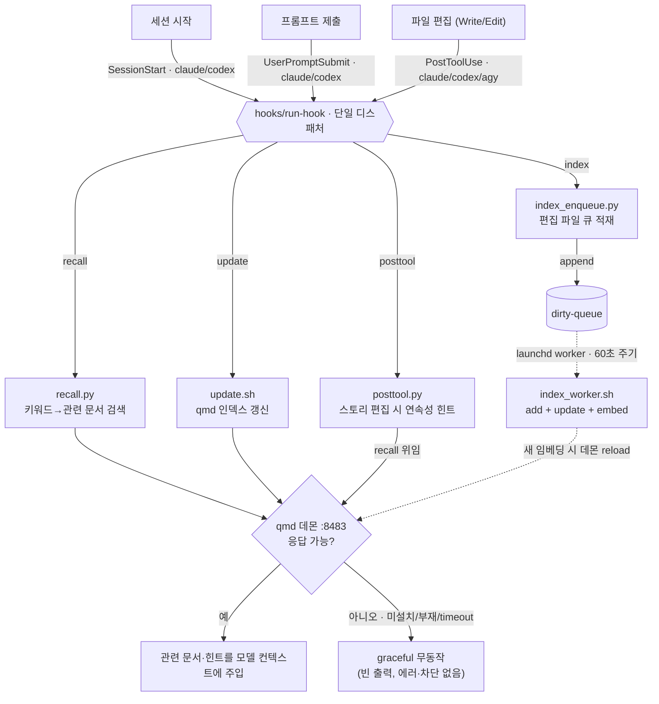

# qmd auto-context

qmd 기반 자동 컨텍스트 주입(세션 시작 시 인덱스 갱신 + 프롬프트마다 관련 문서 recall + 편집 후 연속성 힌트)을 **Claude Code · Codex · Antigravity(Gemini) 세 플랫폼**에서 동작시키는 플러그인.

흩어져 있던 글로벌/프로젝트 qmd 훅을 단일 리포로 SSOT화했다. 플랫폼 무관 `core/` 1벌 + `hooks/run-hook` 단일 디스패처 구조.

## 구조

```
core/        recall.py · update.sh · posttool.py · index_enqueue.py · config.py · keywords.py · resolve_paths.py · collection_match.py · agy_local_install.py
hooks/       run-hook (단일 디스패처) · hooks.json · hooks-codex.json
backend/     daemon.sh · keepalive.sh · logrotate.sh · index_worker.sh · launchd/*.plist (@@HOME@@ 템플릿)
test/        *.test.mjs (node:test)
install.sh · uninstall.sh
```

## 동작

| 훅 | 역할 (core 스크립트) | Claude | Codex | Gemini(agy) |
|----|------|--------|-------|--------|
| 세션 시작 | qmd 인덱스 갱신 (`update.sh`) | `SessionStart` | `SessionStart` | — |
| 프롬프트 제출 | 관련 문서 recall (`recall.py`) | `UserPromptSubmit` | `UserPromptSubmit` | — |
| 편집 후 | 연속성 힌트 (`posttool.py`) + 자동 인덱싱 enqueue (`index_enqueue.py`) | `PostToolUse` | `PostToolUse` | `PostToolUse` |

`hooks/run-hook <action> <engine>` 단일 디스패처가 모든 플랫폼의 훅 진입점이다(action: recall/update/posttool/index). engine 라벨/로그 경로/sandbox 가드 후 `core/<script>`로 stdin을 패스스루한다.

Claude·Codex는 marketplace 플러그인으로 세 이벤트를 모두 받는다. **Gemini(agy)는 marketplace를 지원하지 않아** `install.sh --agy-local <프로젝트>`로 프로젝트 루트 `.agents/hooks.json`에 `PostToolUse`(posttool+index)만 등록한다(SessionStart/recall 미지원; `AfterTool`은 실측상 발동하지 않아 `PostToolUse` matcher `write_to_file|replace_file_content`를 쓴다).

### 흐름도



> **플랫폼 차이**: Claude·Codex는 세 이벤트(`SessionStart`/`UserPromptSubmit`/`PostToolUse`)를 모두 받지만, **Gemini(agy)는 `PostToolUse`만** 받는다 — 세션 시작 인덱스 갱신(`update`)·프롬프트 recall이 없고, **편집 후 연속성 힌트(`posttool`)+자동 인덱싱(`index`)만** 동작한다.

### qmd 미설치 / 데몬 부재 시

모든 훅은 graceful하게 **무동작**한다 — 에러를 내거나 세션을 막지 않는다. CLI fallback이 없어 데몬 HTTP(`:8483`)만 바라본다.

- **recall / posttool**: 데몬 `/health` 실패 시 빈 출력(`reason=daemon_unreachable`). 컨텍스트 주입만 안 될 뿐 프롬프트는 정상 진행된다.
- **update**: `qmd`가 PATH에 없으면 즉시 종료(`exit 0`).
- **index_enqueue**: 편집 파일을 dirty 큐에 적재만 한다(qmd 미호출). 나중에 qmd가 설치되면 worker가 밀린 큐를 처리한다.

즉 **빈 출력은 정상 동작**이다(빈 출력 ≠ 버그). 원인 구분은 `QMD_RECALL_LOG`의 `reason` 필드로 본다.

## 설정 / opt-in (프로젝트 로컬)

동의·거절·설정은 **프로젝트 루트 `.auto-context.json` 단일 파일**로 표현한다. **파일이 없으면 인덱싱·검색하지 않고**(미동의=pending), 세션 시작 시 1회 안내만 한다. 동의/거절은 헬퍼 한 줄로:

```bash
bash core/update.sh --optin  [<프로젝트경로>]   # 동의 → 인덱싱 + 매 세션 자동 갱신
bash core/update.sh --optout [<프로젝트경로>]   # 거절 → 인덱싱·검색 안 함 (영구 침묵)
```

상태는 명시 boolean `indexing`으로 결정된다(`true`=동의 / `false`=거절 / 파일 없음=pending):

```jsonc
{
  "indexing": true,                  // 필수: 인덱싱 동의 여부
  "name": "내 프로젝트",
  "collections": ["proj-manuscript", "proj-plot"],
  "minScore": 0.8,
  "collectionPaths": { "proj-manuscript": "04_Manuscript" }, // posttool reader-facing 판별
  "lexicalPatterns": ["ep"],         // EP/화 번호 exact 검색 (소설 도메인)
  "prefixStyle": "full",             // "full"(기본) | "tag"(마지막 세그먼트)
  "skipPaths": [".zb-context"],
  "topN": 3, "queryTimeout": 5
}
```

레거시 `.agents/qmd-recall.json`은 하위호환으로 계속 읽힌다(`indexing` 키 없으면 collections 있을 때 동의로 간주). `install.sh`는 `QMD_MIGRATE_SCAN`(기본 `~/work/novel`) 범위의 레거시를 `.auto-context.json`으로 마이그레이션하며(멱등·백업), 그 밖의 프로젝트는 `--optin` 실행 시 레거시 내용을 그대로 승계한다.

## 설치 / 제거

```bash
bash install.sh --dry-run             # 변경 계획만 출력 (파일 변경 없음 — 항상 먼저 실행)
bash install.sh                       # 3플랫폼 감지 → 백업 → 레거시/구 훅 정리 → 백엔드(launchd) → 레거시 마이그레이션 → npm test
bash install.sh --agy-local <프로젝트>  # Gemini(agy): 해당 프로젝트 .agents/hooks.json에 PostToolUse(posttool+index) 등록
bash uninstall.sh                     # .bak-original 복원 + 정리
```

install은 멱등하다. 기존 레거시 qmd 글로벌 훅과 구 `adapters/*/wrapper.py` 엔트리를 정리(cleanup)하되 비-qmd 훅은 보존한다. **현행 훅 등록 자체는 marketplace 플러그인(Claude/Codex)과 `--agy-local`(Gemini)이 담당**한다. install 시 레거시 `.agents/qmd-recall.json`을 `.auto-context.json`으로 마이그레이션한다(멱등·백업).

### sandbox

`QMD_SANDBOX=true`/`GEMINI_SANDBOX=true` 또는 `--sandbox` 인자 시 어댑터/코어는 즉시 무출력 종료(격리 환경 데몬 hang 방지).

## 백엔드

`backend/`의 qmd MCP HTTP 데몬(8483) + keepalive + logrotate를 launchd로 상시 운영. install이 `@@HOME@@`를 실제 홈으로 치환해 `~/Library/LaunchAgents`에 배치한다.

편집 후 자동 인덱싱: PostToolUse 훅이 편집 파일을 dirty 큐에 쌓으면, launchd worker(60초 주기)가 백그라운드에서 해당 컬렉션만 `qmd add`+`embed`해 자동으로 최신 상태를 유지한다(macOS 전용).

## 테스트

```bash
npm test    # node --test, 결정적 단위/회귀 테스트
QMD_LIVE=1 node --test test/integration.test.mjs   # 데몬 라이브 스모크
```

데몬 응답은 `test/fixtures/`로 주입(`QMD_QUERY_FIXTURE`)해 라이브 의존 없이 결정적으로 검증한다.
