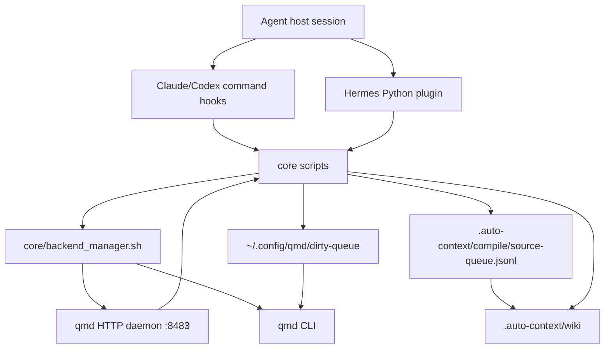

# qmd auto-context Architecture

This document describes the current runtime architecture of `qmd-auto-context`.
It is meant for maintainers who need to change the plugin safely. For user-facing
setup and troubleshooting, start with `README.md`.

## Scope

`qmd-auto-context` is a host plugin that injects project-local document context
into agent conversations. It does not implement the vector database itself.
Instead, it coordinates:

- host hooks for Claude Code, Codex, and Hermes Agent;
- project opt-in and path-safe collection configuration;
- qmd daemon lifecycle and qmd CLI indexing;
- recall query formatting and result filtering;
- dirty-queue based incremental indexing;
- optional wiki compile, review, verify, and dedup workflows.

The main architectural rule is:

> Domain behavior lives in `core/`. Host adapters stay thin and translate host
> events into the shared core JSON contract.

## Design Principles

- **Opt-in by project.** A project is active only when config resolution finds
  non-empty `collections`; a local opt-out marker overrides project config.
  `--optin` and `--optin --recommended` express opt-in by writing
  `.auto-context/settings.json`, not by a separate local opt-in store.
- **Hooks are quiet.** Hook stdout is reserved for host hook payloads or deliberate
  one-time notices. Background work writes to logs.
- **Fail open for agent work.** Missing qmd, a down daemon, empty results, timeout,
  or sandbox mode should skip context injection rather than break the user's turn.
- **One core, many hosts.** Claude/Codex command hooks and Hermes Python hooks call
  the same `core/` scripts.
- **Queue first, work later.** Post-edit indexing and wiki compile are enqueued
  from hooks and drained by one-shot workers.
- **Current state over historical plans.** `docs/plans/` and
  `docs/superpowers/` explain design history. This document describes the code
  paths that are intended to be true now.

## Repository Map

```text
core/
  Platform-neutral behavior:
  config loading, recall, update, gate, posttool hint, dirty queue,
  wiki compile/review/verify/dedup, extractor adapters.

hooks/
  Claude/Codex command hook manifests plus the shared dispatcher. The
  dispatcher still accepts a `gemini` engine label, but AGY automatic hooks are
  currently disabled and only stale-hook cleanup is supported.

hermes_adapter/
  Hermes Agent Python plugin adapter. It maps Hermes callbacks to the same
  core payloads used by command hooks.

backend/
  qmd daemon launcher, keepalive, log rotation, and one-shot index worker.

skills/
  Manual workflows that call the same core scripts as hooks.

agents/
  Resolver prompts for wiki-review and wiki-dedup queue cleanup.

test/
  Deterministic node:test suites. Most tests use fixtures or fake qmd commands
  instead of requiring a live qmd daemon.
```

## Runtime Components



## Host Adapter Layer

### Claude and Codex

Claude and Codex use command hook manifests:

- `hooks/hooks.json`
- `hooks/hooks-codex.json`
- `hooks/run-hook`

`hooks/run-hook` accepts:

```text
run-hook <action> <engine>
```

Actions:

- `recall`
- `update`
- `posttool`
- `index`
- `compile`
- `gate`

The dispatcher resolves the plugin root from `CLAUDE_PLUGIN_ROOT`, `PLUGIN_ROOT`,
or the script location. It exports `QMD_ENGINE`, applies sandbox/headless no-op
guards, and then delegates to `core/`.

### Hermes Agent

Hermes does not read Claude/Codex hook JSON. It uses:

- `plugin.yaml`
- `__init__.py`
- `hermes_adapter/plugin.py`
- `hermes_adapter/core_bridge.py`

Hermes mapping:

| Hermes callback | Core behavior |
|---|---|
| `pre_llm_call` | `core/recall.py` |
| `on_session_start` | `core/update.sh` |
| `pre_tool_call` | `core/preflight_gate.py` |
| `post_tool_call` | `core/posttool.py`, `core/index_enqueue.py`, `core/wiki_compile_enqueue.py` |

Hermes `post_tool_call` is observer-only. It can enqueue indexing and wiki
compile work, but it must not be documented as equivalent to Claude/Codex
posttool context injection.

### Gemini / AGY

The shared dispatcher still has a `gemini` engine label and accepts Gemini-style
event aliases such as `AfterTool`. Product behavior is constrained by the host
payload contract. AGY automatic posttool/index/compile should stay disabled
until there is a reliable payload adapter for edited file paths and stdout
behavior. `scripts/agy-local-hook-install.sh` is currently a stale-hook cleanup
path, not an installer for automatic qmd hooks.

## Configuration Model

The canonical project config is:

```text
.auto-context/settings.json
```

Read-only legacy fallbacks:

```text
.auto-context.json
.agents/qmd-recall.json
```

Local opt-out state is stored outside the project:

```text
~/.config/qmd/optout/<project-hash>.json
```

Resolution is handled by `core/config.py`:

1. Check the local opt-out marker first.
2. Walk upward from `cwd` until the home boundary to find a project config.
3. Merge with conservative defaults.
4. Coerce numeric fields such as `minScore`, `topN`, and `queryTimeout`.
5. Normalize collection roles and compile settings.
6. If no collections are configured, return an inert config.

Important fields:

| Field | Purpose |
|---|---|
| `indexing` | `False` clears effective collections and disables recall/indexing. Auto wiki compile enqueue requires `True`; recall/update compatibility mainly keys off non-empty collections. |
| `collections` | Logical collection names passed to qmd. |
| `collectionPaths` | Project-relative or allowed absolute roots for each collection. |
| `collectionRoles` | `raw`, `session`, or `wiki`. Used by hierarchical recall and compile. |
| `events` | Enables or disables `sessionStart`, `userPromptSubmit`, `postToolUse`. |
| `recallStrategy` | `flat` or `hierarchical`. Hierarchical queries wiki first. |
| `compile` | Wiki auto-compile, verify, semantic dedup, extractor, and queue settings. |

Path safety for collection roots is checked by `core/resolve_paths.py`.
Post-edit collection selection is handled by `core/collection_match.py`, using a
longest-prefix rule so nested collection paths behave predictably.

## Main Flows

### 1. SessionStart Update

Goal: keep qmd collections fresh without making the host session depend on a
long-running backend startup.

Claude/Codex path:

```text
hooks/run-hook update <engine>
  -> backend_manager.sh ensure/warm/rotate in background
  -> core/update.sh
```

Hermes path:

```text
hermes_adapter.core_bridge.session_update()
  -> backend_manager.sh ensure --wait, warm, rotate
  -> core/update.sh with QMD_SUPPRESS_NOTICE=1
```

`core/update.sh` responsibilities:

- migrate legacy config when explicitly requested or on update-time paths;
- resolve configured collections;
- prune settings entries whose collection root no longer exists;
- call `qmd collection add <path> --name <name>`;
- call `qmd update`;
- run `qmd embed` in a background subshell under the shared embed lock;
- reload the daemon after embeddings or removals change daemon-visible state;
- run retroactive wiki dedup scan after embed completes;
- surface one-time notices for daemon-down, stale queue, wiki-review, and
  wiki-dedup backlogs.

The update path still depends on qmd CLI commands. Replacing qmd for indexing
requires replacing this contract, not only changing `QMD_DAEMON_URL`.

### 2. UserPromptSubmit Recall

Goal: return a small host hook payload containing related document references.

```text
hooks/run-hook recall <engine>
  -> backend_manager.sh ensure in background
  -> core/recall.py
```

Hermes calls `core/recall.py` directly through `recall_context`.

`core/recall.py`:

1. Reads hook JSON from stdin.
2. Loads project config.
3. Checks event/config/no-op gates.
4. Extracts lexical terms and keeps the full prompt for vector search.
5. Checks `GET <daemon>/health`.
6. Posts to `POST <daemon>/query`.
7. Injects `_collection` when the daemon result omits it.
8. Applies wiki metadata badges, exact EP promotion, skipPaths, minScore, topN,
   and hierarchical raw backfill.
9. Emits a hook JSON object with `additionalContext`.

The default daemon URL is:

```text
http://localhost:8483
```

It can be overridden for query-time recall and semantic wiki lookup with:

```text
QMD_DAEMON_URL=http://host:port
```

The query HTTP contract is:

```json
{
  "searches": [
    {"type": "lex", "query": "keyword terms"},
    {"type": "vec", "query": "full prompt"}
  ],
  "collections": ["collection-name"],
  "limit": 8,
  "minScore": 0,
  "timeout": 5,
  "rerank": false
}
```

The response contract is:

```json
{
  "results": [
    {
      "file": "qmd://collection/path.md",
      "title": "Optional title",
      "score": 0.91
    }
  ]
}
```

`file` may also be returned as `collection/path.md`. The core parser supports
both forms.

### 3. PreToolUse Gate

Goal: prevent accidental edits in a project that has not opted into qmd
auto-context.

```text
hooks/run-hook gate <engine>
  -> core/preflight_gate.py
```

Hermes maps edit-like tools to Claude-style tool names and calls the same core
script. The gate only targets edit/write/patch style tools. It allows no-op,
sandbox, opt-out, and temporary skip states.

### 4. PostToolUse Continuity Hint

Goal: after an edit, optionally return related context based on newly added text.

```text
hooks/run-hook posttool <engine>
  -> backend_manager.sh ensure --wait
  -> core/posttool.py
```

`core/posttool.py` extracts edited paths and added text from host-specific tool
payloads. It uses configured `collectionPaths` to decide whether the edited file
belongs to a managed collection. If so, it delegates to `core/recall.py` with
the changed text as the prompt.

Claude/Codex can receive this as hook context. Hermes cannot inject this into
the same turn because its `post_tool_call` return value is observer-only.

### 5. PostToolUse Index Enqueue

Goal: record changed collections quickly and let a worker reindex them later.

```text
hooks/run-hook index <engine>
  -> core/index_enqueue.py
  -> backend_manager.sh kick-index
  -> backend/index_worker.sh
```

`core/index_enqueue.py`:

- loads config;
- checks `postToolUse` event enablement;
- maps edited paths to configured collections;
- appends `(collection, collection-path)` records to the dirty queue.

Dirty queue:

```text
~/.config/qmd/dirty-queue
```

`backend/index_worker.sh`:

- snapshots and truncates the dirty queue under a file lock;
- de-duplicates collection/path entries;
- shares writer and embed locks with `core/update.sh`;
- calls `qmd collection add`, `qmd update`, and `qmd embed`;
- reloads the daemon after new embeddings or removed documents;
- requeues work rather than dropping it when locks are busy.

### 6. PostToolUse Wiki Compile Enqueue

Goal: turn edited raw/session Markdown into durable generated wiki candidates
without storing raw transcript content in the hook path.

```text
hooks/run-hook compile <engine>
  -> core/wiki_compile_enqueue.py
  -> backend_manager.sh kick-wiki-compile <cwd>
  -> core/wiki_compile_worker.py
```

`core/wiki_compile_enqueue.py` records metadata only:

- project root;
- source relative path;
- collection name;
- engine;
- trigger.

It only accepts Markdown files in `raw` or `session` role collections. Any path
with a hidden segment such as `.agents`, `.claude`, `.codex`, `.github`, or
`.auto-context` is excluded.

`core/wiki_compile_worker.py` later reads the source file, gathers wiki
orientation context, optionally asks the daemon for similar wiki pages, runs the
configured host extractor, and passes candidate JSON to `core/wiki_compile.py`.

Extractor config is intentionally symbolic by default. The worker resolves
extractors in this order:

1. legacy `compile.extractor.argv`;
2. `compile.extractor.backends[engine]`;
3. symbolic `compile.extractor.builtins`;
4. `compile.extractor.default`.

Built-in adapters run in an isolated temporary cwd with `QMD_SANDBOX=1` so a
nested host CLI does not recursively trigger qmd hooks. Claude and Codex
adapters use no-tools/read-only style flags; Hermes uses its safest one-shot
mode, but may still leave host-local persistence if the host CLI has no
equivalent persistence-off flag.

`core/wiki_compile.py` is the deterministic writer. It:

- rejects unsafe paths and transcript-like content;
- resolves targets by explicit `targetPath`, then `canonicalKey`, `aliases`,
  `title`, and finally title slug;
- protects reviewed/manual/non-managed pages from silent overwrite;
- writes generated wiki files under `.auto-context/wiki`;
- logs merge-needed or rejected candidates under `.auto-context/compile`.

Verify and dedup workers are maintenance paths around this generated wiki state.
They are intentionally fail-open so wiki maintenance does not break normal
agent turns.

## Backend Lifecycle

`core/backend_manager.sh` owns plugin-managed backend lifecycle. It replaces the
older model of persistent product install scripts and managed LaunchAgents.

Commands:

| Command | Purpose |
|---|---|
| `health` | Check qmd daemon `/health`. |
| `check-qmd [--manual]` | Validate qmd CLI version. Manual mode prints install guidance. |
| `start` | Start the daemon if needed. |
| `ensure [--wait]` | Check qmd, start daemon, optionally wait for readiness. |
| `warm` | One-shot keepalive. Health-only by default. |
| `rotate` | One-shot log size guard. |
| `reload` | SIGTERM daemon, wait for clean close, start again. |
| `kick-index` | Start one-shot dirty queue worker. |
| `kick-wiki-compile <cwd> [--flush]` | Start one-shot wiki compile worker for a project. |
| `cleanup-legacy` | Remove only managed legacy LaunchAgent/scripts. |

`backend/daemon.sh` runs qmd in foreground HTTP MCP mode:

```text
qmd mcp --http --port 8483
```

The daemon script resolves the qmd binary, follows the real qmd entrypoint when
possible, and picks a Node binary compatible with `better-sqlite3`.

## Concurrency and Isolation

The runtime uses multiple short-lived processes, so the architecture depends on
clear isolation and lock ownership.

### Host State Isolation

Host adapters pass only normalized JSON payloads, `cwd`, and an engine label into
`core/`. Core scripts must not rely on a host's private in-memory state. Host
differences belong at the adapter boundary:

- command hook dispatch and sandbox guards in `hooks/run-hook`;
- Hermes callback mapping and observer-only caveats in `hermes_adapter/`;
- engine-specific extractor selection in wiki compile worker configuration.

`QMD_ENGINE` is a label for logging, extractor dispatch, and diagnostics. It
must not become a branch point for unrelated domain behavior unless the host
protocol itself requires different handling.

### Lock Ownership

There are three main concurrency surfaces:

| Surface | Owner | Purpose |
|---|---|---|
| update writer lock | `core/update.sh`, `backend/index_worker.sh` | Prevent simultaneous qmd collection/update writers. |
| embed lock | `core/update.sh`, `backend/index_worker.sh` | Prevent concurrent `qmd embed` runs and daemon reload races. |
| worker kick locks | `core/backend_manager.sh` | Coalesce background index/wiki compile starts. |

Dirty queue append and snapshot use `fcntl.flock`, because macOS does not provide
a portable `flock(1)` command by default. When a worker cannot safely proceed, it
requeues entries instead of dropping them.

### Read/Write Boundary

Query-time recall talks to the qmd daemon over HTTP. Indexing-time update/embed
talks to qmd through CLI workers. The two paths meet at the daemon's indexed
state, so embed completion may require a graceful daemon reload before fresh
vectors are visible.

Do not replace graceful `SIGTERM` reload with forced termination. A clean close
lets SQLite checkpoint state and avoids stale or oversized WAL behavior.

### Optional Workflow Isolation

Wiki compile, verify, review, and dedup are optional maintenance workflows. They
must remain fail-open relative to normal recall and indexing. A failed extractor,
missing host CLI, stale verify job, or dedup queue issue should leave an audit
record and preserve or drop only the relevant queue item according to that
worker's contract.

## qmd Backend Boundary

There are two different backend boundaries:

### Query Boundary

Recall and wiki semantic lookup already talk to an HTTP server through:

```text
GET /health
POST /query
```

For experiments, `QMD_DAEMON_URL` can point these query paths to a qmd-compatible
server. A replacement server must preserve the request and response shapes above,
including collection names and file identifiers that the core can map back to
project paths.

### Indexing Boundary

Indexing is not abstracted behind HTTP yet. It is qmd CLI shaped:

```text
qmd collection add <path> --name <name>
qmd collection remove <name>
qmd update
qmd embed
```

These commands are called from `core/update.sh` and `backend/index_worker.sh`.
Therefore a full backend replacement needs one of these approaches:

1. provide a qmd-compatible CLI shim;
2. introduce an explicit backend adapter layer used by update and index worker;
3. move indexing to a new HTTP API and update tests around that contract.

Changing only `QMD_DAEMON_URL` replaces query-time retrieval, not DB creation,
file crawling, incremental update, embedding, or daemon reload behavior.

## Release Surface

Version and host metadata changes span more than one manifest. Keep these files
aligned when changing release identity or marketplace behavior:

- `package.json`;
- `plugin.json`;
- `plugin.yaml`;
- `.claude-plugin/plugin.json`;
- `.codex-plugin/plugin.json`;
- `.claude-plugin/marketplace.json`;
- `.agents/plugins/marketplace.json`;
- `test/probe-manifest.test.mjs`.

For manifest-only changes, run `node --test test/probe-manifest.test.mjs`.
Before release, run `npm test`.

## Manual Skills

Manual skills exist for user-requested workflows and use the same core paths as
hooks:

| Skill | Core path |
|---|---|
| `query` | `core/recall.py` |
| `update` | `core/update.sh` |
| `sync` | `core/sync.py` plus backend index kick |
| `wiki-compile` | `core/wiki_extract.py` and `core/wiki_compile.py` |
| `wiki-review` | `core/wiki_review.py` |
| `wiki-dedup` | `core/wiki_dedup_resolve.py` via resolver workflow |
| `enable-compile` | `core/update.sh --enable-compile` |

Manual skills may print diagnostics. Hook paths should stay quiet.

## Failure Behavior

Expected empty-output cases:

- sandbox or headless mode;
- no config or no collections;
- local opt-out;
- disabled event;
- missing or unsupported qmd;
- daemon unreachable;
- query timeout or malformed response;
- no results after filters;
- edit outside configured collection paths;
- compile disabled or source outside raw/session Markdown scope.

To distinguish expected no-op from a bug, use:

```bash
QMD_RECALL_LOG=/tmp/qmd-recall.log bash skills/query/scripts/query.sh "$PWD" "question"
tail -n 20 /tmp/qmd-recall.log
```

Relevant logs:

| Log | Default |
|---|---|
| hook recall/selection | `$HOME/.cache/qmd/qmd-<engine>-hook.log` |
| backend manager | `$HOME/.cache/qmd/backend-manager.log` |
| qmd daemon | `$HOME/.cache/qmd/mcp.daemon.log` |
| index worker | `$HOME/.cache/qmd/index-worker.log` |
| compile extractor | `.auto-context/compile/extractor.log` |

## Test Strategy

The default test command is:

```bash
npm test
```

Most tests are deterministic and do not require a live qmd daemon. They use:

- fake qmd shell scripts;
- `QMD_QUERY_FIXTURE`;
- mock HTTP servers for `/health` and `/query`;
- temporary project configs;
- sandbox env guards.

Useful focused tests:

```bash
node --test test/recall.test.mjs
node --test test/backend-manager.test.mjs
node --test test/index-worker.test.mjs
node --test test/wiki-compile-worker.test.mjs
node --test test/hermes-plugin-adapter.test.mjs
node --test test/probe-manifest.test.mjs
```

Live daemon smoke is opt-in:

```bash
QMD_LIVE=1 node --test test/integration.test.mjs
```

## Change Checklist

When changing architecture-sensitive code, check these boundaries:

- Does the change keep host adapters thin and `core/` as the source of truth?
- Does it preserve quiet hook stdout?
- Does sandbox/headless mode exit before side effects?
- Does config loading still respect local opt-out and empty-collection no-op?
- Do Claude, Codex, and Hermes still map to equivalent core behavior where the
  host protocol allows it?
- Are qmd CLI and qmd HTTP contracts clearly separated?
- If wiki compile changes, are `raw`/`session` scope, hidden-path rejection,
  cooldown, queue preservation, and protected-page behavior covered?
- If daemon or embed behavior changes, does reload still allow SQLite clean close?
- Are manual skills still wrappers over core scripts rather than alternate
  implementations?
- Is the behavior covered by deterministic tests before relying on a live daemon?
